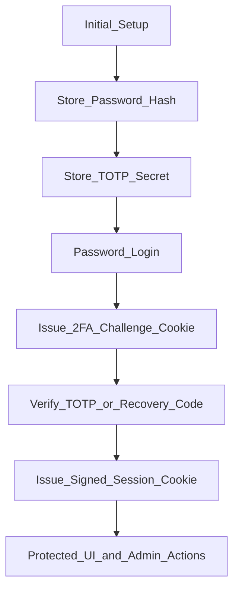

# Synology Monitor Authentication and Authorization Design

## 3. Authentication and Authorization

## 3.1 Password Storage

Current state: `Implemented`

- Hashing function: `werkzeug.security.generate_password_hash` when available.
- Fallback implementation: `pbkdf2_sha256` with:
  - salt: random 16-byte hex (`secrets.token_hex(16)`)
  - iterations: `200000`
  - digest: SHA-256
- Stored field: `password_hash` in `synology-auth.json`.

## 3.2 TOTP Secret Storage

Current state: `Partially Implemented`

- TOTP secret is generated and stored in `auth["totp_secret"]` in `synology-auth.json`.
- At-rest encryption for TOTP secret is **not** implemented.
- File-level control relies on JSON file mode `0600`.

## 3.3 Session Cookie Properties

Current state: `Partially Implemented`

Implemented:

- `HttpOnly`: enabled.
- `SameSite`: `Lax`.
- Expiration policy:
  - challenge cookie TTL: 5 minutes (`AUTH_CHALLENGE_TTL_SEC`)
  - authenticated session TTL: 30 minutes (`AUTH_SESSION_TTL_SEC`)
  - signed payload also contains `exp` timestamp.

Conditional behavior:

- `Secure`: set only if connection is an SSL socket (`isinstance(self.connection, ssl.SSLSocket)`).
- In reverse-proxy TLS termination scenarios where backend is plain HTTP, this can leave `Secure` unset.

## 3.4 CSRF Protection

Current state: `Not Implemented`

- No CSRF token framework is implemented.
- No explicit Origin/Referer enforcement for state-changing POST requests.
- Reliance is primarily on session auth and `SameSite=Lax`.

## 3.5 Brute-Force Protection

Current state: `Partially Implemented`

- Lockout implemented with:
  - max attempts: 5
  - cooldown: 15 minutes
- Lockout state fields: `failed_attempts`, `lockout_until`.
- Per-IP and global distributed rate limits are not implemented.

## 3.6 Authorization Model

Current state: `Implemented` (single admin), `Not Implemented` (RBAC)

- Single-admin model (no roles/permissions matrix).
- Authenticated user has full UI/action privileges.
- No RBAC or scoped operator accounts.

## 3.7 Agent/Peer Privilege Escalation via API

Current state: `Partially Implemented`

- Peer endpoints require bearer token (`Authorization: Bearer <peering_token>`).
- mTLS client cert is required for most peer endpoints once mTLS is enforced.
- `/api/peer/diag` allows token-only mode by design (`allow_token_only=True`).
- No granular role separation between peer capabilities beyond token/mTLS gate.

## Authentication Flow Diagram

## Session Management Explanation

- Session cookie value is signed with HMAC using `session_secret` from auth state.
- Server verifies signature and expiration (`exp`) on each request.
- Logout clears both session and challenge cookies.
- Session invalidation on secret rotation is coarse-grained:
  - if `session_secret` changes, all sessions are invalidated.
- No server-side session table is maintained; integrity is token-signature based.

## Additional Authentication Risks

- TOTP secret stored plaintext in JSON (file compromise can bypass second factor).
- No CSRF token for sensitive POST actions.
- No device/IP binding for authenticated session cookie.

