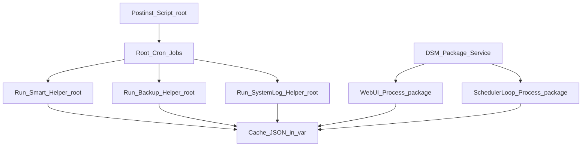

# Synology Monitor Execution Privilege Matrix

## 2. Privilege Model and Execution Context

This matrix reflects behavior implemented in:

- `community-package/package/conf/privilege`
- `community-package/package/scripts/postinst`
- `community-package/package/scripts/start-stop-status`
- `synology-monitor.py`

## 2.1 and 2.2 Runtime Users

| Component | Invocation | Expected User | Why |
|---|---|---|---|
| Web UI service | `synology-monitor.py --ui` from `start-stop-status` | `package` | DSM package conf sets `run-as: package`. |
| Scheduler loop service | `synology-monitor.py --run-scheduled-loop` from `start-stop-status` | `package` | Started by package service script. |
| SMART helper cron | `smart-helper.sh` -> `--run-smart-helper` | `root` | Reads SMART/system resources requiring elevated rights. |
| Backup helper cron | `backup-helper.sh` -> `--run-backup-helper` | `root` | Reads backup status and logs requiring elevated access. |
| System-log helper cron | `system-log-helper.sh` -> `--run-system-log-helper` | `root` | Reads `/var/log/messages`/`syslog`. |
| One-shot scheduler cron | `monitor-scheduler.sh` -> `--run-scheduled` | `root` when in `/etc/crontab` form | Installed with `root` user in `/etc/crontab` fallback. |

## 2.3 Components Requiring Root and Why

| Component | Root Required | Reason |
|---|---|---|
| `--run-smart-helper` | Yes | Explicit euid check; accesses device SMART/NVMe data. |
| `--run-backup-helper` | Yes | Explicit euid check; accesses backup APIs/logs. |
| `--run-system-log-helper` | Yes | Explicit euid check; accesses system logs. |
| Web UI (`--ui`) | No | Intended to run as package user. |
| Scheduler loop (`--run-scheduled-loop`) | No | Regular monitor checks and push actions. |

## 2.4 Privilege Separation Assessment

Current state: `Partially Implemented`

- **Web UI**: non-root (`package`) in package mode.
- **Scheduler**: non-root (`package`) in package mode.
- **System helpers**: root-only helper entry points via cron.
- **Gap**: scheduler one-shot cron is also installed as root in `/etc/crontab` fallback path, reducing strict separation for that path.

## 2.5 Root Helper Script Immutability

Current state: `Partially Implemented`

- Helper scripts are set to mode `0700` by `postinst`.
- No immutable attributes (`chattr +i`) or signed integrity checks are implemented.
- No startup verification of helper script checksum/signature is implemented.

## 2.6 Shell Invocation in Subprocess Calls

Current state: `Partially Implemented`

- Most subprocess use list-based invocation (`subprocess.run([...])` / `Popen([...])`) without shell.
- One shell invocation exists for restart action:
  - `subprocess.Popen(["sh", "-c", cmd])` in `/danger-restart` path.

## Execution Flow Diagram with User Context

